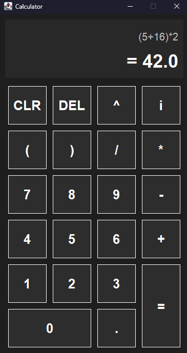

# Calculator

A Java desktop calculator that supports arithmetic expression parsing, tokenization, notation evaluation, and a Swing-based GUI.


## Features
- [x] Standard arithmetic operations
- [x] Expression tokenization
- [x] Expression parsing and evaluation
- [x] Support for operator precedence
- [x] Modular architecture
- [x] Swing GUI
- [x] Unit tested with JUnit

## Screenshot




## Project Structure

```text
src/
├───main
│   ├───java
│   │   └───io
│   │       └───github
│   │           └───pallavjain01
│   │               │   CalculatorMain.java
│   │               │   
│   │               ├───core
│   │               │       Calculator.java
│   │               │       ExpressionEvaluator.java
│   │               │       NotationEvaluator.java
│   │               │       Tokenizer.java
│   │               │       
│   │               ├───data
│   │               │       Token.java
│   │               │       TokenType.java
│   │               │       
│   │               └───gui
│   │                       CalculatorButton.java
│   │                       CalculatorFrame.java
│   │                       CalculatorPanel.java
│   │                       
│   └───resources
└───test
    ├───java
    │   └───io
    │       └───github
    │           └───pallavjain01
    │               └───core
    │                       CalculatorTest.java
    │                       ExpressionEvaluatorTest.java
    │                       NotationEvaluatorTest.java
    │                       TokenizerTest.java
    │                       
    └───resources
```

## Architecture

```
User Input
      │
      ▼
Tokenizer
      │
      ▼
Notation Evaluator
      │
      ▼
Expression Evaluator
      │
      ▼
Result
```

## Technologies

- Java
- Swing
- JUnit
- Gradle (kotlin DSL)

## Usage

Clone the repository:

```bash
git clone https://github.com/pallavjain01/calculator.git
```

Run:

```bash
./gradlew run
```

## Running Tests

```bash
./gradlew test
```

## License

[MIT License](LICENSE)